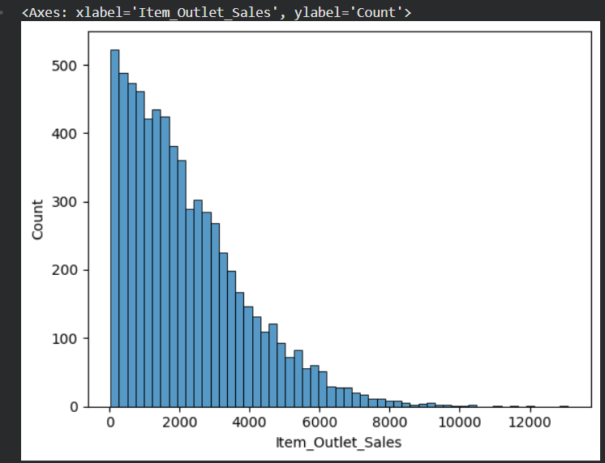

# BigMart Sales Prediction

Machine Learning project for predicting **BigMart product sales** using data preprocessing, feature engineering, and multiple regression models.

---

## 📌 Project Overview

This project aims to predict product sales for BigMart stores using machine learning techniques. The workflow includes exploratory data analysis (EDA), data cleaning, feature engineering, categorical feature encoding, and training multiple regression models to identify the best-performing model.

---

## 📊 Dataset

The project uses the **BigMart Sales Dataset**, which contains information about products and outlets.

### Target Variable
- Item_Outlet_Sales

### Features
- Item_Identifier
- Item_Weight
- Item_Fat_Content
- Item_Visibility
- Item_Type
- Item_MRP
- Outlet_Identifier
- Outlet_Establishment_Year
- Outlet_Size
- Outlet_Location_Type
- Outlet_Type

---

## 🔄 Project Workflow

1. Import Libraries
2. Load Dataset
3. Train-Test Split
4. Exploratory Data Analysis (EDA)
5. Data Cleaning & Feature Engineering
6. Feature Encoding
7. Model Training
8. Model Evaluation

---

## 📈 Exploratory Data Analysis

The following analyses were performed:

- Dataset overview
- Missing value analysis
- Numerical feature analysis
- Categorical feature analysis
- Distribution of the target variable

---

## 🛠 Data Preprocessing

The preprocessing pipeline includes:

- Handling missing values
- Creating new features
- Standardizing categorical values
- Encoding categorical features
- Preparing the dataset for machine learning

---

## 🤖 Machine Learning Models

The following regression models were trained and evaluated:

- Random Forest Regressor
- Gradient Boosting Regressor
- HistGradientBoosting Regressor
- XGBoost Regressor
- LightGBM Regressor

---

## 📊 Model Evaluation

The models were evaluated using regression metrics such as:

- R² Score
- Root Mean Squared Error (RMSE)
- Mean Absolute Error (MAE)

The best-performing model was selected based on these evaluation metrics.

---

## 🖼 Project Screenshots

### Distribution of Item Outlet Sales



### Model Comparison


---

## 💻 Technologies Used

- Python
- Pandas
- NumPy
- Matplotlib
- Seaborn
- Scikit-learn
- XGBoost
- LightGBM
- Jupyter Notebook
- Visual Studio Code

---

## 📂 Repository Structure

```text
Sales-Prediction/
│
├── data/
│   └── sales_prediction.csv
│
├── images/
│   ├── item_outlet_sales_distribution.png
│   └── model_comparison.png
│
├── notebooks/
│   └── BigMart_Sales_Prediction.ipynb
│
├── README.md
├── requirements.txt
├── .gitignore
└── LICENSE
```

---

## 🚀 How to Run

1. Clone the repository

```bash
git clone https://github.com/your-username/Sales-Prediction.git
```

2. Navigate to the project folder

```bash
cd Sales-Prediction
```

3. Install the required packages

```bash
pip install -r requirements.txt
```

4. Open the notebook

```text
notebooks/BigMart_Sales_Prediction.ipynb
```

5. Run all cells from top to bottom.

---

## 📌 Future Improvements

- Perform hyperparameter tuning.
- Explore additional feature engineering techniques.
- Experiment with more regression algorithms.
- Deploy the trained model using Streamlit or Flask.

---

## 👨‍💻 Author

**Your Name**

GitHub: https://github.com/konduruparvatheesh9-svg

---

## 📄 License

This project is licensed under the MIT License.